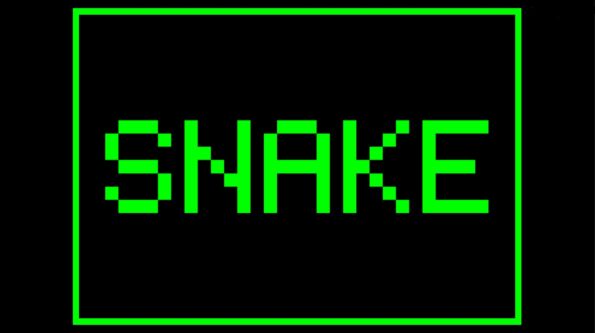

# Unity-Tools-and-Projects

# Snake 2D

This Snake project is inspired by the retro feel of the original game Blockade 1976.
Containg many different elements, this game covers important aspects of game creation incuding controls, spawning and collision detection. I have to give credit this [Unity 2D Snake Tutorial](https://noobtuts.com/unity/2d-snake-game) for inspiring some of my code logic. 